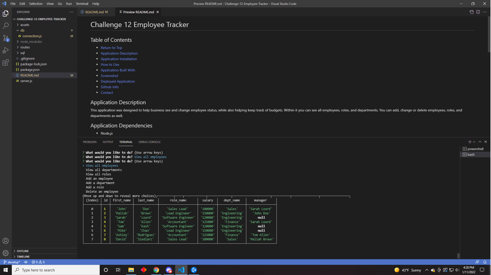

  # Challenge 12 Employee Tracker

  

  ## Table of Contents
  * [Return to Top](#)
  * [Application Description](#application-description)
  * [Application Installation](#application-installation)
  * [How to Use](#how-to-use)
  * [Application Built With](#application-built-with)
  * [Screenshot](#screenshot)
  * [Deployed Application](#deployed-application)
  * [Github Info](#github-info)
  * [Contact](#contact)
  
  ## Application Description
  This application was designed to help business see and change employee status, while also helping keep track of budgets. Within it you can see all employees, roles, and departments. You can add, change or delete employees, roles, and departments as well.
  
  ## Application Dependencies
  * Node.js 
  * Inquirer 
  * Express
  * mysql2
  
  ## How to Use
  To install, clone this repository to your local drive, download the dependencies, and change your username/password within the db/connections.js file. Navigate to your file location in the terminal. type mysql -u ~username~ -p, and enter your password. type source sql/schema.sql and then source/seeds.sql and then quit. type node server or npm start. The program will start and you will have access to the information within those files. Feel free to update them with correct names/roles/departments. The program will give you a prompt of what options you have and as you navigate through them you can make changes as required.
  
  

  ## Application Built With
  * Node.JS
  * Express
  * Mysql2
  * Inquirer
  * Javascript
  
  ## Demo Video Location
  https://watch.screencastify.com/v/rMJ25XxWGpYv9ylMzPg4
  ## Screenshot
  

  ## Github Repo Location
  [https://github.com/DSiedlarz90/Challenge-12-Employee-Tracker](https://github.com/DSiedlarz90/Challenge-12-Employee-Tracker)

  

  ## Github Info
  Github Username: DSiedlarz90

  Github Profile Link: https://github.com/DSiedlarz90

  ## Contact
  If you have any questions or concerns please reach out at:

  [DSiedlarz90@gmail.com](mailto:DSiedlarz90@gmail.com)

  
  
  